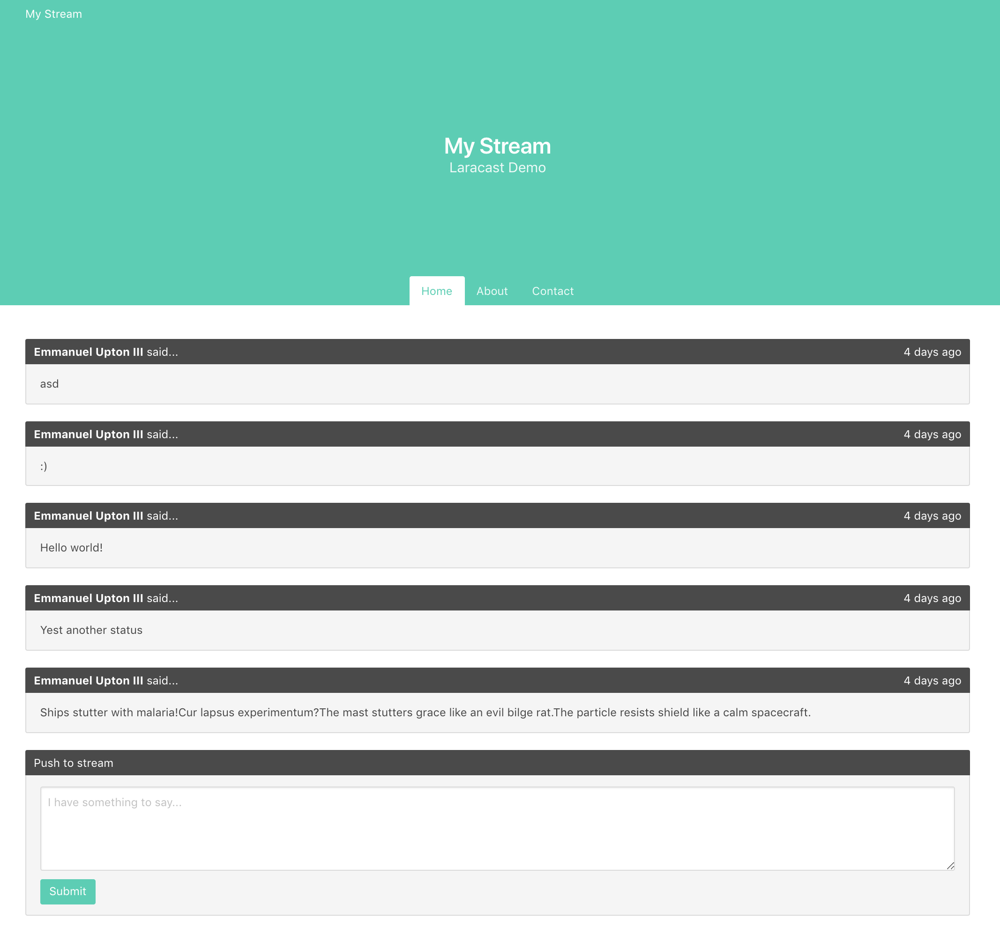

# STREAM :shipit:

SPA Vue + Laravel

Followed  [The Laracast](https://laracasts.com/series/learn-vue-2-step-by-step/)
 series on Vue 2.0. This project is specifically based on episode 26 to 29. 
      
      

## Checking out
If you want to install this project locally, clone it anf follow:  Run -- `composer install` --- then,
---`npm install`---, and finally ----`npm run webpack`---.

Remember to migrate the database with `php artisan migrate`, to seed the database use tinker to create one user. You can add posts from website form. 

I recommend using [Valet](https://laravel.com/docs/5.6/valet) or [Vagrant](https://laravel.com/docs/5.6/homestead), as these tools are the easiest to learn and the
 fastest to develop projects locally on a small scale.
 
**Have fun and**

Piotr Jankiewicz :+1:

Junior Fullstack Developer,

piotrjankiewicz02@gmail.com